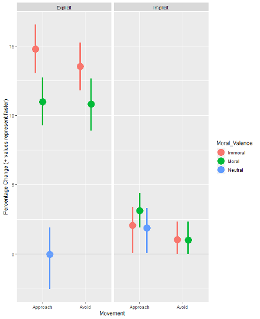
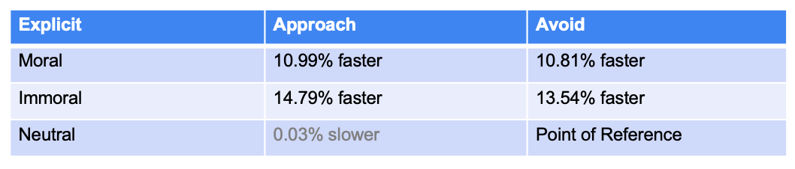
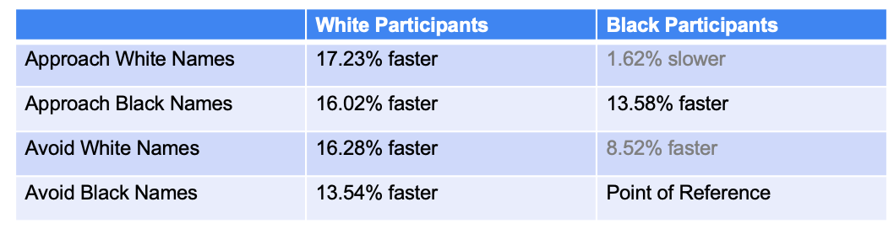
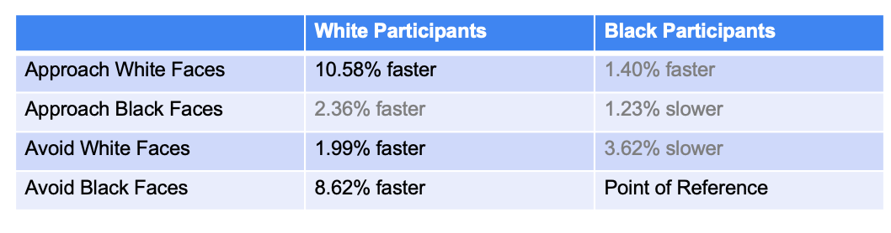

# Moral and Racial Approach-Avoidance Action Tendencies

## Table of Contents
1. [Abstract](#Abstract)
2. [Introduction](#Introduction)  
3. [Methods](#Methods)  
4. [Results](#Results)  
   - [Moral Approach-Avoidance](#Results-Moral)
      - [Setup](#Setup-Moral)
      -  [Discussion of Findings](#Findings-Moral)
   - [Racial Approach-Avoidance](#Results-Racial)
      - [Setup](#Setup-Racial)
      -  [Discussion of Findings](#Findings-Racial)
   
6. [Conclusion](#Conclusion)
7. [Replicating the Analysis](#Technical-Documentation)
8. [Repository Roadmap](#Roadmap)
9. [Resources](#Resources)
10. [Contributors](#Contributors)

## Abstract 
All animal behavior is based on approach and avoidance motivations. Organisms tend to approach things that are positively valenced or beneficial to them and avoid things that are negatively valenced or harmful to them. The automaticity of these fundamental motivations has been supported extensively with empirical research using various types of stimuli, including food, cannabis, animals, and human faces. However, no such research has been published that examines how, if at all, humans manifest automatic approach-avoidance tendencies to moral stimuli in their environment. This is critical as moral interactions are among the most important happenings in an individual’s day-to-day life. Our interactions with one another are shaped by various things (e.g., gender, age, attraction), but perhaps the most salient is race. Our racial identity and the perceived racial identity of those we interact with critically shape our cognition and behavior. Thus,  we must also examine these moral approach-avoidance tendencies in conjunction with varying racial identities.

To that end, three main steps naturally must occur. First, there must be an examination of moral approach-avoidance tendencies. Second, there must be an examination of racial approach-avoidance tendencies. And third, they must be examined in combination. This capstone project involved with the first two steps. Using traditional null hypothesis testing inferential statistics and machine learning algorithms, our results suggest we were able to successfully capture and identify both moral and racial approach-avoidance tendencies in isolation. Regarding morality, a modified online approach-avoidance task showed people are quicker to approach three-word phrases that are morally good compared to morally bad as well as avoiding morally bad images faster than morally good ones. Regarding race, people generally show an in-group preference where they approach faces or names that are congruent with their own racial identity quicker incongruent and avoid incongruent race stimuli faster than congruent race stimuli. Taken together, these results provide evidence and motivation to look at the interaction of racial and moral approach-avoidance tendencies. 

## Introduction 

### Background and Motivation
The Approach-Avoidance Tendencies method works to examine motivated behaviors and implicit attitudes by presenting subjects with stimuli of a given theme and measuring the time it takes for individuals to approach and/or avoid such stimuli as instructed. The first approach-avoidance task was done in 1960 by Solarz and colleagues, in which the researchers used stimulus cards containing words on a stage, instructing the participants to approach and avoid the cards by pulling and pushing on a hand lever. As a result, this application of the Approach-Avoidance Tendencies approach utilizes a physical distance between the subject and the stimuli, which they increase or decrease based on the researcher’s instruction and the valence of the stimuli (Solarz, 1960). The next development of the AAT involved the introduction of the joystick, where researchers transitioned the stimulus presentation to a computer screen but maintained the physical pushing and pulling motions through a joystick, positioned halfway between the subject and the screen. To measure approach and avoidance tendencies using the joystick method, subjects are instructed to push or pull the joystick based on the content of the presented stimuli. When subjects pull the joystick towards themselves, the stimulus on the computer screen is replaced by a larger version of the same stimulus, simulating a zooming-in effect and representing a real-world approach action. Alternatively, when subjects push the joystick, the stimulus is replaced with a smaller version of itself, therefore shrinking and simulating the result of an avoidance (Rinck & Becker, 2007). The action of pulling and pushing the joystick coupled with the zooming in and out of the stimulus categorizes this task as the feedback-joystick task, and ensures that pulling of the joystick is associated with approach and pushing with avoidance. Yet another measure of approach-avoidance tendencies is known as the manikin task, and uses a computer and a keyboard, therefore eliminating the arm flexion (physical pushing and pulling) used in the previous approaches. In the manikin task, participants use keys on the computer’s keyboard in order to move a simulated manikin on the screen towards or away from a stimulus (De Houwer et al, 2001). While the manikin task produces larger effect sizes than the feedback-joystick task on the same experiments, it may not be as predictive of real-world behaviors, putting the approach and avoidance actions in the manikin’s perspective, rather than the subjects’ perspective (Krieglmeyer & Deutsch, 2009)

While there are many Approach-Avoidance Tendencies (AAT) methods available to researchers, none have applied the approach to moral stimuli. Yet, approach-avoidance biases have been found using the many AAT methods outlined above, in a variety of contexts. In the first Approach-Avoidance Tendencies study using the physical stimulus cards, which depicted pleasant and unpleasant words, researchers found an approach-avoidance action tendency bias such that participants more quickly approached positive words and more quickly avoided negative words (Solarz, 1960). Other studies have utilized images for stimuli rather than words, with one group of researchers presenting pictures of spiders, butterflies, and gray control images to children with varying degrees of fear towards spiders. Klein and colleagues found that children showed an automatic avoidance tendency towards pictures of spiders, but not towards pictures of butterflies or a gray image. Further, they showed that female children, but not male, with a greater reported fear of spiders and more anxious behavior showed the greatest avoidance tendency bias (Klein et al, 2010). Another study looked at the approach-avoidance tendencies of socially-anxious individuals (as compared to non-socially-anxious subjects) in response to pictures depicting smiling, angry, and neutral facial expressions. Here, researchers found that socially-anxious individuals pushed angry faces away more quickly than they approached them and showed a strong avoidance tendency towards smiling faces as well, all while showing neither approach nor avoidance tendencies towards neutral faces (Heuer et al, 2007). Finally, researchers investigated the approach-avoidance tendencies towards cannabis and neutral images in both heavy cannabis users and controls, finding that heavy cannabis users demonstrate an approach bias towards cannabis-related images. Interestingly, this approach bias was correlated with changes in future cannabis use, with stronger approach-biases predictive of increases in weekly cannabis use after six months (Cousijn et al, 2011). With the variety of approach and avoidance biases shown through these AAT experiments, this method may be a promising tool to uncover moral approach-avoidance tendencies, shining light on individuals’ implicit moral and racial biases. The use of Approach-Avoidance tendency tasks offers the opportunity to look at moral and racial attitudes through the lens of motivation, which may prove to be more useful and predictive of our behaviors in real-world situations. A complete literature review can be found in the reports section of this repository.

### Overview
- (overview) our major contributions and findings

## Data and Methodology

##### About the Data
Study 1 : MAAT
* [MoralImg](Modeling_and_Results/MoralImages.Rmd)
* [MoralPh](Modeling_and_Results/MoralPhrases.Rmd)

For the Moral approach-avoidance task, we had two datasets: phrases and images. For the phrases dataset, we surveyed 660 individuals on numerous prompts, creating a collective 49,238 number of prompted results (both explicit/implicit and varying moral valence). For the images dataset, we surveyed an additional 617 individuals, leading to 45,744 number of trials for this dataset.

**Variables**: For the implicit task, the individuals were given a series of stimuli and were told to either approach/avoid the stimuli based on its moral content (i.e., Jon could be assigned to approach immoral valence and avoid moral valence). The stimuli had varying moral valence: moral, neutral, and immoral. In case for mistakes/misunderstanding of the task, we measured accuracy; however, we were interested in measuring response time, which is our response variable. Before the task, respondants were asked to fill out a questionnaire to gather vital variables for our analysis. These variables include participant age, gender, race/ethnicity, political leaning (scale 1-7), as well as their post-rating on (1) how moral, (2) how pleasant, and (3) how complicated the prompt was to understand. 

Study 2: R-MAAT [RacialAA](Modeling_and_Results/Racial_Approach_Avoidance.qmd)

For the Racial approach-avoidance task, we again had two datasets: names and faces. While we had data for both implicit and explicit racial biases results, our final results we only throughly discuss the explicit prompts. For the explicit names dataset, we surveyed 157 individuals: 89 were white and 68 were black (alone). We had a total 5,748 number of trials. For the explicit faces dataset, we surveyed 185 individuals: 107 were white and 78 were black. We had a total 7,186 number of trials.

**Varaibles**: The names were composed of either black-sounding names or white-sounding names, and the faces dataset was strictly black or white faces. Following the same structure, individuals were told to either approach or avoid names based on the prompt’s presumed race. Before the task, respondants were asked to fill out a questionnaire to gather informative variables used in the model, which include age, gender, race/ethnicity, marital status, political leaning (scale 1-7), household income, and zip code. The zip code infomration was used to gather the racial demographics where the respondents lived, which was then transformed into a black/white population ratio. More questions were also asked to measure their big 5 personality type as well as their racial surroundings — ie, the number of your closest colleagues who are white/black.

##### Modeling
In both MAAT and R-MAAT, we built a linear regression mixed effect model, where we used participant as a random effect. This is because it is natural to expect person-to-person variability in terms of reaction to a prompt.

The questions of interest were as follows:
Moral:
* Do people show an approach bias to morally good stimuli?
* Do people show an avoidance bias to morally bad stimuli?

Racial:
* Will White people show an approach bias to white (a) names and (b) faces?
* Will Black people will show an approach bias to white (a) names and (b) faces?
* Will the gender of the participant and stimulus will influence the above relationships?

To be able to answer these hypotheses, we had to include interaction terms, and then a bootstrapping analysis to compare between the two populations to test if the difference we see in response time is significant.

To built both the moral (MAAT) and racial (R-MAAT) models, we subdivided each dataset into two, one for the explicit measures and one for the implicit measures. Since there were many explanatory variables, we had our first model include all, as well as the interactions necessary to be able to answer our hypotheses. We then ran that model and looked at the indiividual variable significance level: all variables with a p-value less than 0.1 were included in the next iteration to test for significance again. The process continued until our final model, where only the variables with significance as well as the experimental variables were included in the model.

The final model for the moral dataset (explicit):

$$ log(\text{response time}_{ij}) = \beta_0 + \beta_{0i} + \beta_1 \times \mathbb{1}(\text{BirthGender = "Female"}) + \beta_2 \times \mathbb{1}(\text{Race= "White"}) + ... + \beta_7 \times\mathbb{1} (\text{Race=="Prefer not to answer"}) + \beta_8\times \text{Age} + \beta_9\times \mathbb{1}(\text{Movement="Approach"}) + \beta_{10}\times \mathbb{1} (\text{Morality = "Moral"}) + \beta_{11} \times \mathbb{1}(\text{Morality = "Immoral"}) + \beta_{12}\times \mathbb{1} (\text{Movement="Approach"})\times \mathbb{1}(\text{Morality="Moral"}) + \beta_{13}(\text{Movement="Approach"})\times\mathbb{1}(\text{"Morality="Immoral"}) $$
____

The final model for the racial dataset (explicit):

______

The implicit modeling was not seen to be significantly useful. A potential culprit to this is the experimental design. When individuals were told to respond based on color, it is likely the color on their screen was overpowering and didn’t need to even process the content at hand to respond to the computer prompt. So, for sake of our results, we only present the edxplicit findings. 

## Results 
In this section, we will discuss...

### Moral Approach-Avoidance 

#### Setup 
Implicit/explicit, phrases/images

#### Discussion of Findings 
##### Phrases

  

* Within Explicit, approaching moral phrases is 4.04% faster than immoral phrases, 95% CI: (2.24%, 5.67%)
* Within Explicit, difference in avoiding is not significant.

  

##### Images

  

* Within Explicit, approaching immoral photos is 4.46% faster than moral photos, 95% CI: (2.23%, 6.85%)
* Within Explicit, Avoiding Immoral Photos is 3.16% faster than avoiding Moral Photos, 95% CI: (1.19%, 5.18%)

  

### Racial Approach-Avoidance 

#### Setup 
implicit/explicit, names/faces

#### Discussion of Findings 
tables, graphs
##### Names

  

##### Faces

  

## Conclusion 
##### Do humans exhibit moral approach-avoidance tendencies (and can they serve as proxies for implicit attitudes)? Yes!
* People approach moral phrases faster than they approach immoral phrases​
* People approach moral images slower than they approach immoral images* (a deviation from what we would expect)
* People avoid immoral images faster than moral images

##### Do humans exhibit racial approach-avoidance tendencies (and can they serve as proxies for implicit attitudes)? Yes!
* Black People Approach Black Names faster than White Names​
* White People Approach White Faces faster than Black Faces​
* White People Avoid White Names faster than Black Names​​
* White People Avoid Black Faces faster than White Faces

<i> We are not trying to imply racism, but more or less explaining a tendency of approaching something one is familiar with or avoiding something one is unfamiliar with. </i>

## Replicating the Analysis 
* For linear models and bootstrapping results to make the conclusions above (and all files ending in .rmd/.qmd), open a R session and File > New Project > Version Control > Git and copy in the link from the dropdown SSH.
* For privacy reasons, the data needed to run these models will only be available upon request.
* All .ipynb work can be replicated through a JupyterLab session. This is used for ML model analysis as well as feature engineering.

## Repository Roadmap 
1. Reports: Contains Files on our 1st semester presentation (Moral), milestone report, project motivation, and a literature review)
2. Modeling and Results:
      * Functions.R: Supplementary code to run bootstrap methods
      * MoralImages.Rmd: Analysis on moral approach/avoidance for images (implicit/explicit)
      * MoralPhrases.Rmd: Analysis on moral approach/avoidance for phrases (implicit/explicit)
      * Racial_Approach_Avoidance.qmd: Analysis on racial approach/avoidance (includes both faces and names, implicit and explicit)
3. Preprocessing and ML: Contains files used for data processing, white/black ratio feature engineering for analysis, and ML models
4. Capstone Presentation: Our presentation given at the symposium (3/29/2024)

## Resources 

## Contributors 
Paul McKee
Kristi Van Meter
Natalie Smith
Sanskriti Purhoit
